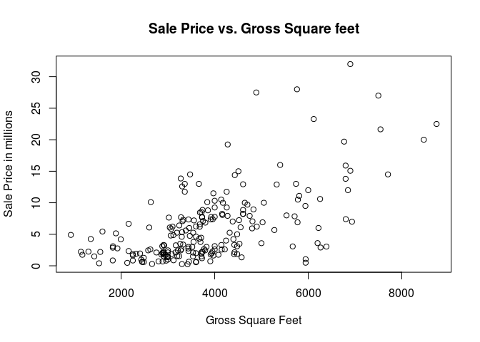
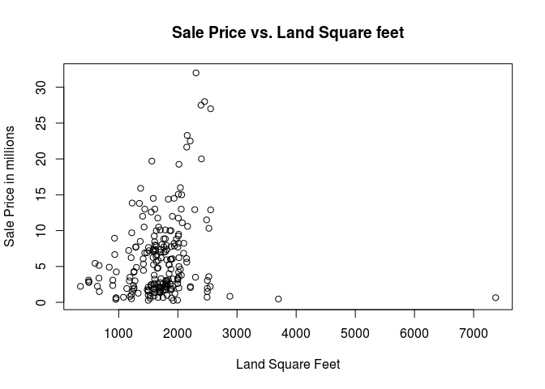

# Paper
Ramesh, Alexandra and Gino  
October 16, 2016  


## Overview

The purpose of this project is to download,read in building sales of borough manhatten and examine the sales data set. To further understand the data we split the data into building that we are going to perform our analysis ex. Family and Condos   

## Family   

Here was extracted builidings that are 1,2,3 bedroom family homes, we cleaned up the data to perform analysis on columns that have gross sqaure feet, land square feet and price data avialble.

* Below is the dimensions and a summary of the data set


```r
dim(mn.homes)
```

```
## [1] 219  25
```

```r
str(mn.homes)
```

```
## 'data.frame':	219 obs. of  25 variables:
##  $ borough                       : int  1 1 1 1 1 1 1 1 1 1 ...
##  $ neighborhood                  : Factor w/ 39 levels "ALPHABET CITY            ",..: 1 2 2 2 2 2 5 6 6 6 ...
##  $ building.class.category       : Factor w/ 41 levels "01  ONE FAMILY DWELLINGS                    ",..: 3 1 1 2 2 3 2 2 2 3 ...
##  $ tax.class.at.present          : Factor w/ 9 levels "  ","1","1A",..: 2 2 2 2 2 2 2 2 2 2 ...
##  $ block                         : int  376 722 771 742 745 719 1053 445 449 448 ...
##  $ lot                           : int  24 10 52 19 11 58 55 1 10 46 ...
##  $ ease.ment                     : logi  NA NA NA NA NA NA ...
##  $ building.class.at.present     : Factor w/ 122 levels "  ","A1","A4",..: 11 3 6 10 3 11 105 105 105 11 ...
##  $ address                       : Factor w/ 11614 levels "1000 AVENUE OF THE AMER                  ",..: 5389 8910 4272 6978 7472 8596 8861 9878 8506 6576 ...
##  $ apartment.number              : Factor w/ 2686 levels "            ",..: 1 1 1 1 1 1 1 1 1 1 ...
##  $ zip.code                      : int  10009 10011 10011 10011 10011 10011 10036 10003 10003 10003 ...
##  $ residential.units             : int  3 1 1 2 1 3 2 2 2 3 ...
##  $ commercial.units              : int  0 0 0 0 0 0 1 1 1 0 ...
##  $ total.units                   : int  3 1 1 2 1 3 3 3 3 3 ...
##  $ land.square.feet              : Factor w/ 1027 levels " -   "," 100 ",..: 405 403 379 423 409 316 342 160 908 252 ...
##  $ gross.square.feet             : Factor w/ 1457 levels " -   "," 1,000 ",..: 715 642 754 887 1078 658 693 1074 637 917 ...
##  $ year.built                    : num  1900 1910 1901 1910 1910 ...
##  $ tax.class.at.time.of.sale     : int  1 1 1 1 1 1 1 1 1 1 ...
##  $ building.class.at.time.of.sale: Factor w/ 121 levels "A1","A4","A5",..: 10 2 5 9 6 10 104 104 104 10 ...
##  $ sale.price                    : Factor w/ 6787 levels " -   "," 1 ",..: 3372 694 6279 4972 261 5601 4049 5374 3075 5853 ...
##  $ sale.date                     : Factor w/ 350 levels "10/10/2015","10/11/2015",..: 15 301 75 144 350 319 91 138 20 234 ...
##  $ sale.price.n                  : num  3775000 13000000 8800000 6109000 11095675 ...
##  $ gross.sqft                    : num  3696 3360 3855 4554 5808 ...
##  $ land.sqft                     : num  2059 2057 1975 2147 2074 ...
##  $ outliers                      : num  0 0 0 0 0 0 0 0 0 0 ...
```

* 5 Number summary on Sales Price, Gross Square Feet and Land Square Feet

```r
summary(mn.homes$sale.price.n)
```

```
##     Min.  1st Qu.   Median     Mean  3rd Qu.     Max. 
##   250000  2100000  4300000  6028000  7960000 32000000
```

```r
summary(mn.homes$gross.sqft)
```

```
##    Min. 1st Qu.  Median    Mean 3rd Qu.    Max. 
##     924    3030    3696    3886    4480    8745
```

```r
summary(mn.homes$land.sqft)
```

```
##    Min. 1st Qu.  Median    Mean 3rd Qu.    Max. 
##     353    1499    1699    1718    1939    7373
```

## Sale Price vs Gross Square feet 


<!-- -->

Note that the `echo = FALSE` parameter was added to the code chunk to prevent printing of the R code that generated the plot.


## Sale Price vs Land Square feet 


<!-- -->

Note: From the plot, it makes sense, houses with a backyard is limited in Manhattan, mostly between 1000 to 4000 sqft.

## Condos  

Here was extracted builidings that are Condos, we cleaned up the data to perform analysis on columns that have gross sqaure feet, land square feet and price data avialble. However condos data set did not have information on gross sqaure feet and land square feet therefore they where excluded from our analysis

* Below is the dimensions and a summary of the data set


```r
dim(mn.condos)
```

```
## [1] 5380   25
```

```r
str(mn.condos)
```

```
## 'data.frame':	5380 obs. of  25 variables:
##  $ borough                       : int  1 1 1 1 1 1 1 1 1 1 ...
##  $ neighborhood                  : Factor w/ 39 levels "ALPHABET CITY            ",..: 1 1 1 1 1 1 1 1 1 1 ...
##  $ building.class.category       : Factor w/ 41 levels "01  ONE FAMILY DWELLINGS                    ",..: 11 11 11 11 11 11 11 11 11 11 ...
##  $ tax.class.at.present          : Factor w/ 9 levels "  ","1","1A",..: 5 5 5 5 5 5 5 5 5 5 ...
##  $ block                         : int  373 373 384 392 392 392 392 394 394 394 ...
##  $ lot                           : int  1002 1010 1224 1019 1075 1085 1122 1503 1504 1505 ...
##  $ ease.ment                     : logi  NA NA NA NA NA NA ...
##  $ building.class.at.present     : Factor w/ 122 levels "  ","A1","A4",..: 87 87 87 87 87 87 87 87 87 87 ...
##  $ address                       : Factor w/ 11614 levels "1000 AVENUE OF THE AMER                  ",..: 6785 6785 6315 1718 1718 1718 10461 3067 3067 3067 ...
##  $ apartment.number              : Factor w/ 2686 levels "            ",..: 922 1668 2290 1560 233 2277 1560 922 929 932 ...
##  $ zip.code                      : int  10009 10009 10002 10009 10009 10009 10009 10009 10009 10009 ...
##  $ residential.units             : int  1 1 1 1 1 1 1 1 1 1 ...
##  $ commercial.units              : int  0 0 0 0 0 0 0 0 0 0 ...
##  $ total.units                   : int  1 1 1 1 1 1 1 1 1 1 ...
##  $ land.square.feet              : Factor w/ 1027 levels " -   "," 100 ",..: 1 1 1 1 1 1 1 1 1 1 ...
##  $ gross.square.feet             : Factor w/ 1457 levels " -   "," 1,000 ",..: 1 1 1 1 1 1 1 1 1 1 ...
##  $ year.built                    : num  1920 1920 2005 1928 1928 ...
##  $ tax.class.at.time.of.sale     : int  2 2 2 2 2 2 2 2 2 2 ...
##  $ building.class.at.time.of.sale: Factor w/ 121 levels "A1","A4","A5",..: 86 86 86 86 86 86 86 86 86 86 ...
##  $ sale.price                    : Factor w/ 6787 levels " -   "," 1 ",..: 856 5860 6478 1475 6501 2065 961 4607 6051 5341 ...
##  $ sale.date                     : Factor w/ 350 levels "10/10/2015","10/11/2015",..: 287 287 320 156 92 327 157 201 196 216 ...
##  $ sale.price.n                  : num  1395796 792812 925000 1750000 931000 ...
##  $ gross.sqft                    : num  NA NA NA NA NA NA NA NA NA NA ...
##  $ land.sqft                     : num  NA NA NA NA NA NA NA NA NA NA ...
##  $ outliers                      : num  0 0 0 0 0 0 0 0 0 0 ...
```

* 5 Number summary on Sales Price

```r
summary(mn.condos$sale.price.n)
```

```
##      Min.   1st Qu.    Median      Mean   3rd Qu.      Max. 
##    101000    965000   1700000   2939000   3200000 260800000
```

